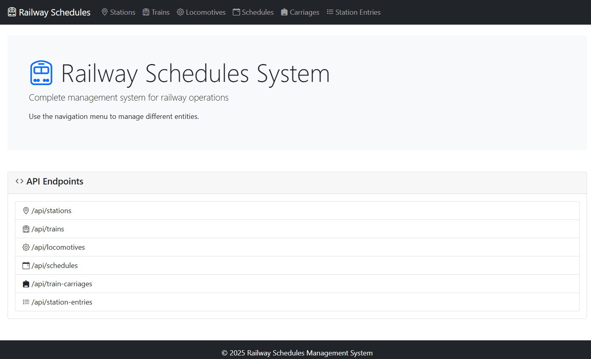
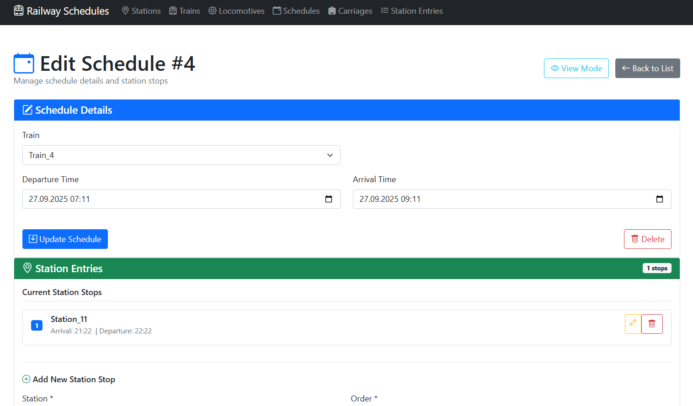
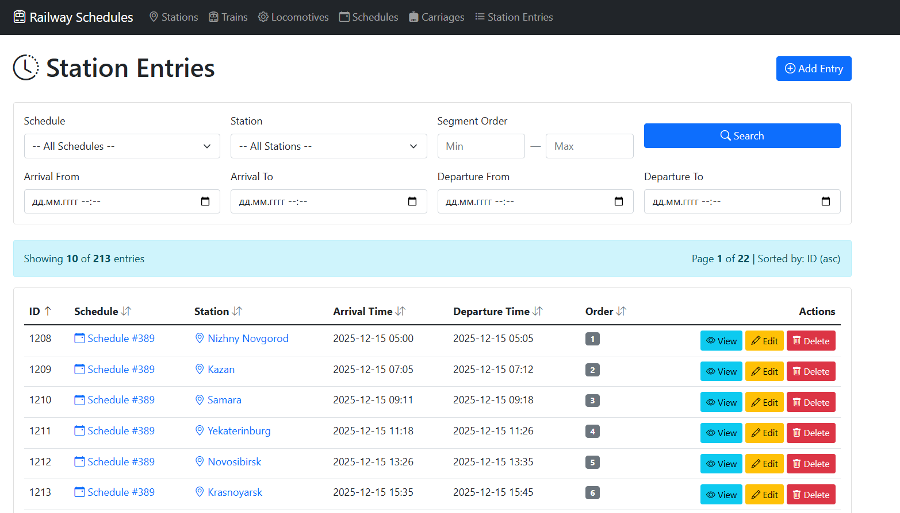

# Railway Schedules System

REST API приложение для управления железнодорожными операциями: станциями, поездами, локомотивами, расписаниями и остановками.

## ✨ Функциональность

Приложение предоставляет полный набор операций для управления железнодорожной инфраструктурой:

| Модуль | Описание |
|--------|----------|
| **Stations** | Управление железнодорожными станциями |
| **Trains** | Управление поездами |
| **Locomotives** | Управление локомотивами |
| **Schedules** | Создание и редактирование расписаний поездов |
| **Carriages** | Управление вагонами |
| **Station Entries** | Управление остановками поездов на станциях |

### Возможности системы

- 📅 Создание расписаний с указанием времени отправления и прибытия
- 🚉 Добавление промежуточных остановок с порядковыми номерами
- 🔍 Фильтрация и поиск записей по множеству параметров
- 📝 CRUD-операции для всех сущностей
- 📊 Пагинация и сортировка данных

## 🛠 Технологический стек

- **Backend:** Java 17, Spring Boot         
- **База данных:** PostgreSQL 15
- **Контейнеризация:** Docker, Docker Compose
- **Сборка:** Maven
## Скриншоты
|  |
|:--:|
| *Главная страница* |

|  |
|:--:|
| *Редактирование станции* |

|  |
|:--:|
| *Список станций* |
